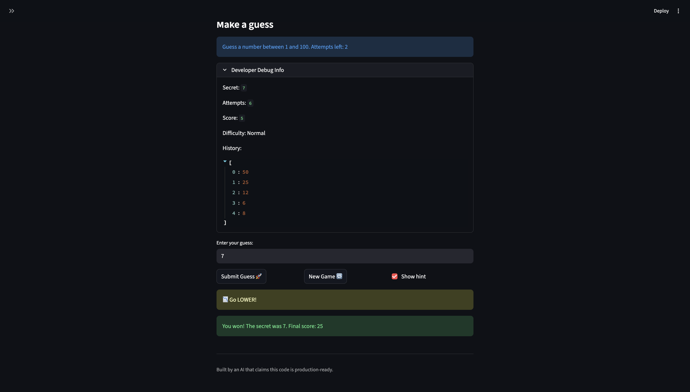
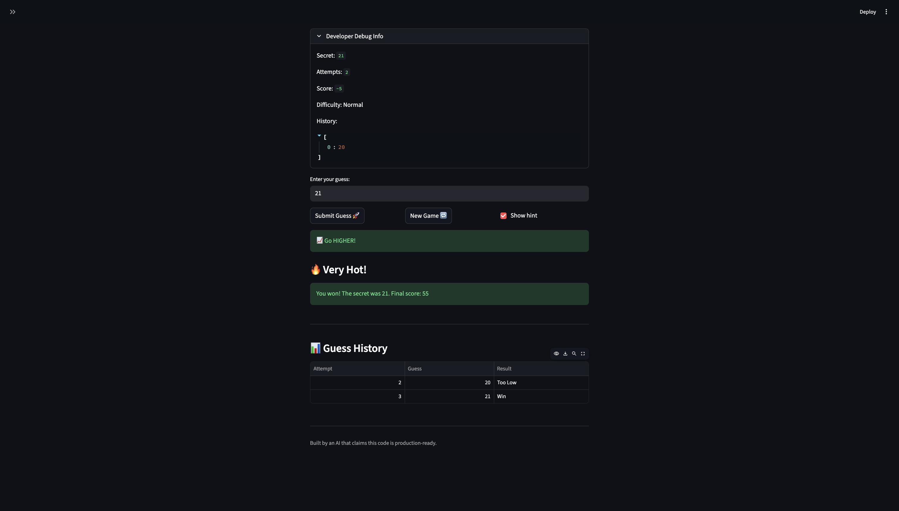

# 🎮 Game Glitch Investigator: The Impossible Guesser

## 🚨 The Situation

You asked an AI to build a simple "Number Guessing Game" using Streamlit.
It wrote the code, ran away, and now the game is unplayable. 

- You can't win.
- The hints lie to you.
- The secret number seems to have commitment issues.

## 🛠️ Setup

1. Install dependencies: `pip install -r requirements.txt`
2. Run the broken app: `python -m streamlit run app.py`

## 🕵️‍♂️ Your Mission

1. **Play the game.** Open the "Developer Debug Info" tab in the app to see the secret number. Try to win.
2. **Find the State Bug.** Why does the secret number change every time you click "Submit"? Ask ChatGPT: *"How do I keep a variable from resetting in Streamlit when I click a button?"*
3. **Fix the Logic.** The hints ("Higher/Lower") are wrong. Fix them.
4. **Refactor & Test.** - Move the logic into `logic_utils.py`.
   - Run `pytest` in your terminal.
   - Keep fixing until all tests pass!

## 📝 Document Your Experience

- [X] Describe the game's purpose.
This project is a number guessing game where the player has to guess a number within a given range. The code for the game was generated by AI, but it contains several bugs and some features do not work correctly. The goal of the project is to play the game, identify the bugs, and then use AI to help fix those issues. This helps us practice debugging and understanding AI-generated code.
- [X] Detail which bugs you found.
Three bugs were identified in the game. The first bug is related to the hint feature, which does not work correctly. The second bug involves the game state, where the game does not reset or update properly. The third bug is related to history logging, where previous guesses or actions are not recorded as expected.
- [X] Explain what fixes you applied.
⏺ Bug 1: Removed the even-attempt string cast of the secret so hints always use numeric comparison.
  Bug 2: Reset all five state keys (attempts, secret, score, status, history) on new game instead of just two.
  Bug 3: Added st.rerun() after each in-progress guess so history updates immediately instead of one submit late.

## 📸 Demo

- [X] [Insert a screenshot of your fixed, winning game here]

Note: The game was played without knowing the secret using the binary search strategy.

## 🚀 Stretch Features

### Challenge 3: Professional Documentation and Linting

Added PEP 257 docstrings and PEP 8 formatting to all functions in `logic_utils.py`

### Challenge 4: Enhanced Game UI

Added color-coded hints, a hot/cold temperature indicator, and a guess history summary table to improve the player experience.

